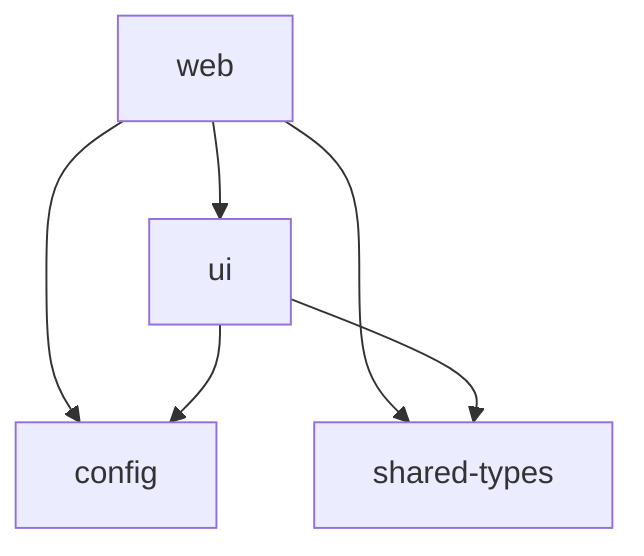

# NetPost V2 Development Guide

This guide covers development workflows, best practices, and technical details for contributing to NetPost V2.

## 🛠️ Development Setup

### System Requirements

- Node.js 18.17.0 or later
- npm 10.2.4 or later
- Git 2.34.0 or later

### Initial Setup

1. **Clone and install dependencies**:

```bash
git clone https://github.com/RosagerImaging/netpost-v2.git
cd netpost-v2
npm install
```

2. **Set up environment variables**:

```bash
cp env.example .env.local
# Edit .env.local with your configuration
```

3. **Start development server**:

```bash
npm run dev
```

## 📦 Monorepo Architecture

### Turborepo Configuration

NetPost V2 uses Turborepo for:

- **Build orchestration**: Parallel builds with dependency awareness
- **Caching**: Intelligent build and test caching
- **Task running**: Coordinated script execution across packages

### Package Structure

```
packages/
├── ui/               # React component library
├── config/           # Shared configurations
└── shared-types/     # TypeScript type definitions

apps/
├── web/              # Next.js web application
├── mobile/           # React Native (placeholder)
└── api/              # FastAPI backend (placeholder)
```

### Inter-package Dependencies



## 🔄 Development Workflow

### Daily Development

1. **Pull latest changes**:

```bash
git pull origin main
```

2. **Install any new dependencies**:

```bash
npm install
```

3. **Start development mode**:

```bash
npm run dev
```

This starts all packages in watch mode:

- `@netpost/ui`: Rebuilds when component files change
- `@netpost/config`: Rebuilds when config files change
- `@netpost/shared-types`: Rebuilds when type files change
- `web`: Next.js dev server with hot reload

### Making Changes

#### UI Component Changes

1. Edit files in `packages/ui/src/`
2. Components automatically rebuild
3. Web app hot reloads with changes
4. Test in browser at `http://localhost:3000`

#### Configuration Changes

1. Edit files in `packages/config/src/`
2. Configuration rebuilds automatically
3. Restart dev server to pick up config changes

#### Type Definition Changes

1. Edit files in `packages/shared-types/src/`
2. Types rebuild automatically
3. TypeScript compiler picks up changes immediately

### Building for Production

```bash
# Build all packages
npm run build

# Build specific package
cd packages/ui && npm run build
```

Build order is automatically managed by Turborepo based on dependencies.

## 🧪 Testing Strategy

### Unit Testing

```bash
# Run all tests
npm run test

# Run tests in watch mode
npm run test:watch

# Run tests with coverage
npm run test:coverage
```

### Component Testing

```bash
# Start Storybook (coming soon)
npm run storybook

# Build Storybook static site
npm run build-storybook
```

### End-to-End Testing

```bash
# Run Playwright tests (coming soon)
npm run test:e2e

# Run E2E tests in UI mode
npm run test:e2e:ui
```

## 📝 Code Standards

### TypeScript Guidelines

- **Strict mode**: All packages use strict TypeScript
- **Type imports**: Use `import type` for type-only imports
- **Explicit returns**: Always specify return types for functions
- **No any**: Avoid `any` type, use `unknown` or specific types

```typescript
// Good
import type { User } from "@netpost/shared-types";

export function getUserName(user: User): string {
  return `${user.firstName} ${user.lastName}`;
}

// Avoid
export function getUserName(user: any) {
  return user.firstName + " " + user.lastName;
}
```

### React Guidelines

- **Functional components**: Use function components with hooks
- **Component props**: Define explicit prop types
- **Event handlers**: Use proper event types
- **Refs**: Use `useRef` with proper typing

```tsx
// Good
interface ButtonProps {
  onClick: (event: MouseEvent<HTMLButtonElement>) => void;
  children: ReactNode;
  variant?: "primary" | "secondary";
}

export function Button({
  onClick,
  children,
  variant = "primary",
}: ButtonProps) {
  return (
    <button onClick={onClick} className={cn(buttonVariants({ variant }))}>
      {children}
    </button>
  );
}
```

### CSS/Tailwind Guidelines

- **Utility-first**: Use Tailwind utilities over custom CSS
- **Component variants**: Use `class-variance-authority` for component variants
- **Design tokens**: Use design system colors and spacing
- **Responsive design**: Mobile-first responsive design

```tsx
// Good - using design tokens and variants
<Button className="bg-primary-500 hover:bg-primary-600 px-4 py-2">
  Submit
</Button>

// Avoid - custom styles
<Button style={{ backgroundColor: "#00BFFF", padding: "8px 16px" }}>
  Submit
</Button>
```

## 🔧 Package Development

### Creating New Components

1. **Add to UI package**:

```bash
cd packages/ui
# Create component file
touch src/components/new-component.tsx
# Export from index
echo 'export { NewComponent } from "./components/new-component";' >> src/index.ts
```

2. **Build and test**:

```bash
npm run build
npm run lint
npm run type-check
```

3. **Use in web app**:

```tsx
import { NewComponent } from "@netpost/ui";
```

### Adding New Types

1. **Add to shared-types package**:

```bash
cd packages/shared-types
# Create or edit type file
touch src/new-types.ts
# Export from index
echo 'export type { NewType } from "./new-types";' >> src/index.ts
```

2. **Build and use**:

```bash
npm run build
# Use in other packages
import type { NewType } from "@netpost/shared-types";
```

### Updating Configurations

1. **Edit config package**:

```bash
cd packages/config
# Edit configuration
vim src/tailwind.ts
```

2. **Rebuild and restart**:

```bash
npm run build
# Restart dev server to pick up changes
cd ../../ && npm run dev
```

## 🚀 Deployment

### Vercel Deployment (Web App)

1. **Connect repository** to Vercel
2. **Set environment variables** in Vercel dashboard
3. **Deploy automatically** on push to main

### Package Publishing

```bash
# Version and publish UI package
cd packages/ui
npm version patch
npm publish

# Version and publish config
cd ../config
npm version patch
npm publish
```

## 🔍 Debugging

### Development Issues

1. **Clear caches**:

```bash
# Clear Turborepo cache
npx turbo clean

# Clear Next.js cache
rm -rf apps/web/.next

# Clear node_modules and reinstall
rm -rf node_modules package-lock.json
npm install
```

2. **Check dependency issues**:

```bash
npm run type-check
npm run lint
npm run build
```

3. **Debug specific package**:

```bash
cd packages/ui
npm run build --verbose
```

### Common Issues

- **Build failures**: Check TypeScript errors with `npm run type-check`
- **Import errors**: Ensure packages are built with `npm run build`
- **Style issues**: Check Tailwind configuration and CSS imports
- **Hot reload not working**: Restart dev server

## 📊 Performance

### Bundle Analysis

```bash
# Analyze Next.js bundle
cd apps/web
npm run analyze

# Check package sizes
npm run build && du -sh packages/*/dist
```

### Optimization Tips

- Use dynamic imports for large components
- Optimize images with Next.js Image component
- Use code splitting at route level
- Minimize bundle size with tree shaking

## 🤝 Git Workflow

### Branch Strategy

- `main`: Production-ready code
- `develop`: Integration branch (if needed)
- `feature/*`: New features
- `fix/*`: Bug fixes
- `docs/*`: Documentation updates

### Commit Messages

Use conventional commit format:

```
type(scope): description

body (optional)

footer (optional)
```

Examples:

- `feat(ui): add new Button component variants`
- `fix(web): resolve responsive layout issue`
- `docs(readme): update development setup guide`

### Pull Request Process

1. Create feature branch from `main`
2. Make changes with proper tests
3. Ensure all quality checks pass
4. Create pull request with description
5. Request review from team members
6. Merge after approval

---

## 📚 Additional Resources

- [Turborepo Documentation](https://turbo.build/repo/docs)
- [Next.js Documentation](https://nextjs.org/docs)
- [Tailwind CSS Documentation](https://tailwindcss.com/docs)
- [TypeScript Handbook](https://www.typescriptlang.org/docs/)
- [React Documentation](https://react.dev/)
