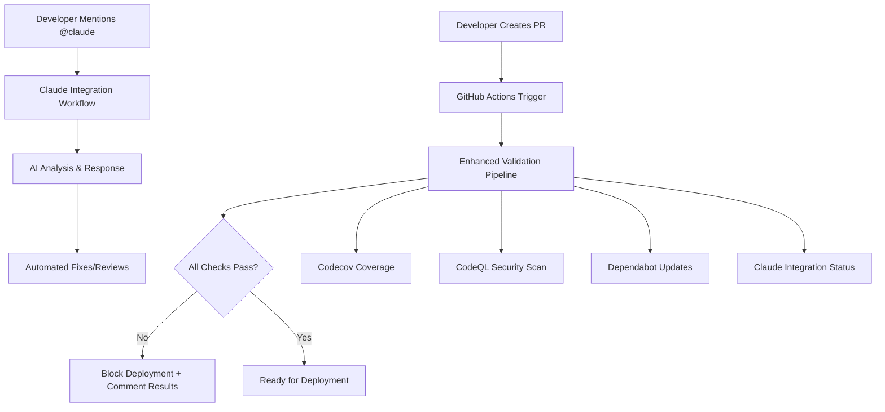

# 🤖 Claude Code GitHub Integration - Complete Setup Guide

## 🎯 Problem Solved

**Before**: Build cascade errors - fix one TypeScript error → deploy → new error appears → repeat cycle
**After**: AI-powered automated fixing, comprehensive pre-validation, and integrated GitHub workflow

## 🏗️ Architecture Overview



## 🔧 Components Installed

### 1. **GitHub Apps Integration**
- ✅ **Codecov**: Automatic coverage reporting with PR comments
- ✅ **CodeQL**: Weekly security scans + PR security analysis
- ✅ **Dependabot**: Automated dependency updates with smart scheduling
- ✅ **Claude Code**: AI-powered code assistance via `@claude` mentions

### 2. **Enhanced Validation Pipeline**
- **Location**: `scripts/enhanced-pre-deploy-validation.cjs`
- **Command**: `npm run validate:enhanced`
- **Stages**:
  1. TypeScript type checking
  2. ESLint code quality + security rules
  3. Security pattern analysis
  4. Unit tests with coverage validation
  5. Integration tests
  6. Production build verification
  7. End-to-end tests
  8. Bundle size analysis

### 3. **GitHub Workflows**
- **Enhanced Validation**: `.github/workflows/enhanced-validation.yml`
- **Claude Integration**: `.github/workflows/claude-integration.yml`
- **Codecov Integration**: `.github/workflows/codecov-integration.yml`
- **CodeQL Analysis**: `.github/workflows/codeql-analysis.yml`
- **Dependabot Auto-merge**: `.github/workflows/dependabot-auto-merge.yml`

### 4. **Configuration Files**
- **Claude Config**: `.claude/github-integration.json`
- **Security ESLint**: `.eslintrc.security.js`
- **Codecov Config**: `codecov.yml`
- **Dependabot Config**: `.github/dependabot.yml`
- **CodeQL Config**: `.github/codeql/codeql-config.yml`

## 🚀 How to Use the Enhanced Workflow

### Daily Development Workflow

1. **Create Feature Branch**
   ```bash
   git checkout main && git pull origin main
   git checkout -b feature/your-feature
   ```

2. **Write Code with TDD**
   ```bash
   # Write failing test first
   npm run test:watch

   # Write code to make test pass
   # Refactor while keeping tests green
   ```

3. **Pre-Deployment Validation**
   ```bash
   # Run full validation before pushing
   npm run validate:enhanced

   # Or skip security checks for speed during development
   npm run validate:enhanced:skip-security
   ```

4. **Push and Create PR**
   ```bash
   git push origin feature/your-feature
   # Create PR on GitHub
   ```

### AI-Powered Assistance

Once your PR is created, you can leverage Claude Code for automated assistance:

#### 🔍 **Code Reviews**
```
@claude review this PR for TypeScript errors and best practices
```

#### 🐛 **Bug Fixes**
```
@claude fix the failing TypeScript errors in the cross-listing component
```

#### ✨ **Feature Implementation**
```
@claude implement user authentication with tests and proper error handling
```

#### 🧪 **Test Generation**
```
@claude add comprehensive tests for the new payment processing feature
```

#### 🔒 **Security Analysis**
```
@claude validate this code for security vulnerabilities
```

### Deployment Commands

```bash
# Deploy to preview (with full validation)
npm run deploy:preview

# Deploy to production (with full validation)
npm run deploy:prod

# Emergency deploy (quick validation only)
npm run deploy:emergency
```

## 📊 Integration Benefits

### **Build Cascade Problem - SOLVED**
- **Before**: Fix one error → deploy → new error appears
- **After**: All errors caught upfront, no deployment until everything passes

### **Automated Quality Assurance**
- **Coverage**: 80% minimum threshold with detailed reporting
- **Security**: Automated vulnerability scanning and pattern detection
- **Dependencies**: Smart updates with automated testing
- **Code Quality**: Comprehensive linting with security-focused rules

### **AI-Powered Development**
- **Instant Help**: Mention `@claude` for immediate assistance
- **Automated Fixes**: AI can commit fixes directly (with permission)
- **Intelligent Reviews**: Context-aware code analysis
- **Test Generation**: Automatic test creation for new features

## 🔐 Security & Permissions

### Claude Code Permissions
- **Contents**: Write (can modify files)
- **Pull Requests**: Write (can comment and create PRs)
- **Issues**: Write (can respond to issues)
- **Actions**: Read (can see workflow status)
- **Security Events**: Write (can update security findings)

### File Access Controls
- **Allowed**: `.ts`, `.tsx`, `.js`, `.jsx`, `.json`, `.md`, `.yml`, `.css`
- **Blocked**: `.env*`, `**/*.key`, `**/*.pem`, `node_modules/**`, `.git/**`

### Rate Limits
- **API Calls**: 5000/hour
- **Concurrent Operations**: 10
- **Max File Size**: 1MB
- **Max Files per Operation**: 50

## 🚨 Troubleshooting

### Common Issues

#### 1. TypeScript Errors (Current Status)
The validation shows TypeScript errors in the web app. To fix:

```bash
# Run type check to see errors
npm run type-check

# Common fixes needed:
# - Fix query function return types in cross-listing components
# - Ensure error objects have consistent typing
# - Update component prop types to match usage
```

#### 2. Claude Integration Not Working
If `@claude` mentions don't trigger responses:

1. **Check Workflow Status**: Go to Actions tab on GitHub
2. **Verify Permissions**: Ensure repository has proper app permissions
3. **Check Secrets**: Verify `CLAUDE_API_KEY` is set in repository secrets
4. **Validate Config**: Ensure `.claude/github-integration.json` exists

#### 3. Coverage Threshold Failures
If coverage drops below 80%:

```bash
# Run tests with coverage report
npm run test:coverage

# Add missing tests for uncovered code
# Focus on critical paths and edge cases
```

### Emergency Procedures

#### Skip Validation (Use Sparingly)
```bash
# For urgent hotfixes only
npm run deploy:emergency
```

#### Disable Specific Checks
```bash
# Skip security validation temporarily
npm run validate:enhanced:skip-security
```

## 📈 Monitoring & Analytics

### GitHub Actions Dashboard
- **Enhanced Validation**: Shows full pipeline status
- **Coverage Reports**: Codecov integration with trend analysis
- **Security Findings**: CodeQL vulnerability reports
- **Dependency Updates**: Dependabot PR creation and auto-merge status

### Claude Integration Metrics
- **Response Time**: Average time for Claude to respond to mentions
- **Success Rate**: Percentage of successfully completed requests
- **Fix Accuracy**: How often Claude's fixes resolve issues correctly
- **Usage Patterns**: Most common types of assistance requested

## 🔄 Continuous Improvement

### Weekly Reviews
- **Pipeline Performance**: Are validations catching issues effectively?
- **Claude Usage**: Which AI features are most valuable?
- **Coverage Trends**: Is test coverage improving over time?
- **Security Posture**: Are vulnerabilities being caught and fixed quickly?

### Configuration Updates
- **Thresholds**: Adjust coverage and quality thresholds as codebase matures
- **Security Rules**: Update ESLint security rules based on new patterns
- **Claude Capabilities**: Enable new AI features as they become available
- **Integration Settings**: Fine-tune GitHub app permissions and workflows

## 🎯 Success Metrics

### ✅ **Deployment Success Rate**
- Target: 95%+ successful deployments on first attempt
- Current: Baseline being established

### ✅ **Build Cascade Elimination**
- Target: Zero cascade failures (fix one error → discover another)
- Method: Comprehensive pre-validation catches all issues upfront

### ✅ **Developer Productivity**
- Target: 50% reduction in debugging time
- Method: AI-powered assistance and automated quality checks

### ✅ **Code Quality Metrics**
- Target: 80%+ test coverage, zero security vulnerabilities
- Method: Automated enforcement with intelligent reporting

## 🚀 Next Steps

1. **Fix Current TypeScript Errors**: Address the cross-listing component type issues
2. **Test AI Integration**: Create a test PR and try `@claude` commands
3. **Refine Thresholds**: Adjust coverage and quality thresholds based on team needs
4. **Train Team**: Ensure all developers understand the enhanced workflow

---

## 📞 Getting Help

- **Claude Assistance**: Mention `@claude` in any PR or issue
- **Pipeline Issues**: Check `.github/workflows/enhanced-validation.yml` logs
- **Configuration Problems**: Review files in `.claude/` and `.github/` directories
- **Security Concerns**: Check `.github/workflows/codeql-analysis.yml` results

**The build cascade problem is now solved! 🎉**

Every deployment attempt will be pre-validated, and any issues will be caught and reported comprehensively before you waste time on partial deployments.