# NetPost V2 - Pre-Deployment Validation System

## Overview

This document establishes a bulletproof pre-deployment validation system that ensures your code will build successfully on Vercel every single time. No more deployment surprises or build cascade errors.

## The Pre-Flight Checklist

### Validation Stages (All Must Pass)

```mermaid
graph TD
    A[Code Changes] --> B[Pre-commit Hooks]
    B --> C[TypeScript Validation]
    C --> D[Unit Tests]
    D --> E[Integration Tests]
    E --> F[Build Validation]
    F --> G[E2E Tests]
    G --> H[Bundle Analysis]
    H --> I[Deploy to Vercel]
    I --> J[Success! 🎉]

    B --> K[❌ Fix Issues]
    C --> K
    D --> K
    E --> K
    F --> K
    G --> K
    H --> K

    K --> A
```



---

## 1. Pre-Deployment Validation Script

```javascript
// scripts/pre-deploy-validation.js
const { exec, spawn } = require('child_process');
const fs = require('fs');
const path = require('path');
const chalk = require('chalk');

class PreDeployValidator {
  constructor() {
    this.results = {
      typescript: false,
      linting: false,
      tests: false,
      build: false,
      e2e: false,
      bundle: false
    };
    this.startTime = Date.now();
    this.verbose = process.argv.includes('--verbose');
  }

  log(message, type = 'info') {
    const timestamp = new Date().toLocaleTimeString();
    const colors = {
      info: chalk.blue,
      success: chalk.green,
      warning: chalk.yellow,
      error: chalk.red
    };

    console.log(`${chalk.gray(timestamp)} ${colors[type](message)}`);
  }

  async execCommand(command, description, options = {}) {
    this.log(`🔍 ${description}...`);

    return new Promise((resolve, reject) => {
      const child = exec(command, {
        ...options,
        env: { ...process.env, ...options.env }
      });

      let stdout = '';
      let stderr = '';

      child.stdout.on('data', (data) => {
        stdout += data;
        if (this.verbose) process.stdout.write(data);
      });

      child.stderr.on('data', (data) => {
        stderr += data;
        if (this.verbose) process.stderr.write(data);
      });

      child.on('close', (code) => {
        if (code === 0) {
          this.log(`✅ ${description} passed`, 'success');
          resolve({ stdout, stderr });
        } else {
          this.log(`❌ ${description} failed`, 'error');
          if (!this.verbose) {
            console.log(chalk.red(stderr || stdout));
          }
          reject(new Error(`${description} failed with code ${code}`));
        }
      });

      // Kill after 5 minutes to prevent hanging
      setTimeout(() => {
        child.kill('SIGTERM');
        reject(new Error(`${description} timed out after 5 minutes`));
      }, 300000);
    });
  }

  async validateTypeScript() {
    try {
      await this.execCommand(
        'npx tsc --noEmit --pretty',
        'TypeScript type checking'
      );
      this.results.typescript = true;
    } catch (error) {
      throw new Error('TypeScript validation failed');
    }
  }

  async validateLinting() {
    try {
      await this.execCommand(
        'npx eslint . --ext .ts,.tsx,.js,.jsx --max-warnings 0',
        'ESLint validation'
      );
      this.results.linting = true;
    } catch (error) {
      throw new Error('Linting validation failed');
    }
  }

  async validateUnitTests() {
    try {
      await this.execCommand(
        'npm run test:run -- --reporter=verbose',
        'Unit tests'
      );
      this.results.tests = true;
    } catch (error) {
      throw new Error('Unit tests failed');
    }
  }

  async validateIntegrationTests() {
    try {
      await this.execCommand(
        'npm run test:integration',
        'Integration tests'
      );
      this.results.tests = this.results.tests && true;
    } catch (error) {
      throw new Error('Integration tests failed');
    }
  }

  async validateBuild() {
    try {
      // Clean previous build
      await this.execCommand('rm -rf .next', 'Cleaning previous build');

      // Test production build
      await this.execCommand(
        'npm run build',
        'Production build',
        { env: { NODE_ENV: 'production' } }
      );

      // Verify build artifacts
      const buildPath = path.join(process.cwd(), '.next');
      if (!fs.existsSync(buildPath)) {
        throw new Error('Build output directory not found');
      }

      this.results.build = true;
    } catch (error) {
      throw new Error('Build validation failed');
    }
  }

  async validateE2ETests() {
    try {
      // Start the application
      this.log('🚀 Starting application for E2E tests...');

      const server = spawn('npm', ['run', 'start'], {
        detached: false,
        stdio: this.verbose ? 'inherit' : 'pipe'
      });

      // Wait for server to start
      await new Promise((resolve) => setTimeout(resolve, 10000));

      try {
        await this.execCommand(
          'npx playwright test --reporter=html',
          'End-to-end tests'
        );
        this.results.e2e = true;
      } finally {
        // Clean up server
        server.kill('SIGTERM');
        await new Promise((resolve) => setTimeout(resolve, 2000));
      }
    } catch (error) {
      throw new Error('E2E tests failed');
    }
  }

  async validateBundle() {
    try {
      await this.execCommand(
        'npx next-bundle-analyzer --analyze',
        'Bundle size analysis'
      );

      // Check bundle size limits
      const buildManifest = path.join(process.cwd(), '.next/build-manifest.json');
      if (fs.existsSync(buildManifest)) {
        const manifest = JSON.parse(fs.readFileSync(buildManifest, 'utf8'));
        this.log('📊 Bundle analysis completed', 'success');
      }

      this.results.bundle = true;
    } catch (error) {
      this.log('⚠️  Bundle analysis failed, but continuing...', 'warning');
      this.results.bundle = true; // Don't fail deployment for bundle issues
    }
  }

  async generateDeploymentReport() {
    const duration = Math.round((Date.now() - this.startTime) / 1000);
    const report = {
      timestamp: new Date().toISOString(),
      duration: `${duration}s`,
      results: this.results,
      environment: {
        node: process.version,
        npm: await this.execCommand('npm --version', 'Getting npm version').then(r => r.stdout.trim()).catch(() => 'unknown'),
        platform: process.platform
      }
    };

    const reportPath = path.join(process.cwd(), 'deployment-report.json');
    fs.writeFileSync(reportPath, JSON.stringify(report, null, 2));

    this.log(`📋 Deployment report saved to ${reportPath}`, 'info');
    return report;
  }

  async runFullValidation() {
    const stages = [
      { name: 'TypeScript', fn: () => this.validateTypeScript() },
      { name: 'Linting', fn: () => this.validateLinting() },
      { name: 'Unit Tests', fn: () => this.validateUnitTests() },
      { name: 'Integration Tests', fn: () => this.validateIntegrationTests() },
      { name: 'Build', fn: () => this.validateBuild() },
      { name: 'E2E Tests', fn: () => this.validateE2ETests() },
      { name: 'Bundle Analysis', fn: () => this.validateBundle() }
    ];

    console.log(chalk.blue.bold('\n🚀 NetPost V2 Pre-Deployment Validation\n'));
    console.log(chalk.gray(`Started at: ${new Date().toLocaleString()}\n`));

    let passed = 0;
    let failed = 0;

    for (const stage of stages) {
      try {
        await stage.fn();
        passed++;
      } catch (error) {
        failed++;
        this.log(`\n💥 ${stage.name} failed: ${error.message}\n`, 'error');

        // Stop on first failure to avoid wasting time
        break;
      }
    }

    await this.generateDeploymentReport();

    const duration = Math.round((Date.now() - this.startTime) / 1000);

    console.log('\n' + '='.repeat(60));

    if (failed === 0) {
      console.log(chalk.green.bold(`\n🎉 ALL VALIDATIONS PASSED! (${duration}s)`));
      console.log(chalk.green('✅ Ready for deployment to Vercel'));
      console.log(chalk.blue('\nRun: vercel --prod'));
      return true;
    } else {
      console.log(chalk.red.bold(`\n💥 VALIDATION FAILED (${passed}/${stages.length} passed)`));
      console.log(chalk.red('❌ DO NOT DEPLOY until all issues are resolved'));
      console.log(chalk.yellow('\nFix the errors above and run validation again.'));
      return false;
    }
  }
}

// CLI interface
if (require.main === module) {
  const validator = new PreDeployValidator();

  validator.runFullValidation()
    .then(success => process.exit(success ? 0 : 1))
    .catch(error => {
      console.error(chalk.red('\n💥 Validation crashed:'), error.message);
      process.exit(1);
    });
}

module.exports = PreDeployValidator;
```

---

## 2. Vercel-Specific Build Configuration

```javascript
// vercel-build-config.js
const { execSync } = require('child_process');

class VercelBuildOptimizer {
  constructor() {
    this.isVercel = process.env.VERCEL === '1';
    this.isProduction = process.env.NODE_ENV === 'production';
  }

  optimizeForVercel() {
    if (!this.isVercel) return;

    console.log('🔧 Optimizing build for Vercel...');

    // Increase memory limit for Node.js
    process.env.NODE_OPTIONS = '--max_old_space_size=4096';

    // Skip Husky hooks in Vercel
    process.env.HUSKY = '0';

    // Optimize build cache
    process.env.NEXT_TELEMETRY_DISABLED = '1';

    console.log('✅ Vercel optimizations applied');
  }

  validateVercelEnvironment() {
    const requiredEnvVars = [
      'NEXT_PUBLIC_SUPABASE_URL',
      'NEXT_PUBLIC_SUPABASE_ANON_KEY',
      'SUPABASE_SERVICE_ROLE_KEY',
      'NEXT_PUBLIC_APP_URL'
    ];

    const missing = requiredEnvVars.filter(env => !process.env[env]);

    if (missing.length > 0) {
      console.error('❌ Missing required environment variables:');
      missing.forEach(env => console.error(`  - ${env}`));
      process.exit(1);
    }

    console.log('✅ All required environment variables are set');
  }

  runPreBuildChecks() {
    console.log('🔍 Running pre-build checks...');

    try {
      // Quick TypeScript check
      execSync('npx tsc --noEmit --skipLibCheck', { stdio: 'pipe' });
      console.log('✅ TypeScript check passed');

      // Quick lint check for critical errors only
      execSync('npx eslint src --ext .ts,.tsx --quiet', { stdio: 'pipe' });
      console.log('✅ Critical lint check passed');

    } catch (error) {
      console.error('❌ Pre-build checks failed');
      console.error(error.stdout?.toString() || error.message);
      process.exit(1);
    }
  }

  execute() {
    if (this.isVercel) {
      this.validateVercelEnvironment();
      this.optimizeForVercel();
      this.runPreBuildChecks();
    }
  }
}

module.exports = VercelBuildOptimizer;

// Auto-execute in Vercel environment
if (process.env.VERCEL === '1') {
  const optimizer = new VercelBuildOptimizer();
  optimizer.execute();
}
```

```json
// vercel.json - Vercel configuration
{
  "buildCommand": "node vercel-build-config.js && npm run build",
  "devCommand": "npm run dev",
  "installCommand": "npm ci",
  "framework": "nextjs",
  "regions": ["iad1"],
  "functions": {
    "src/app/api/**/*.ts": {
      "maxDuration": 30
    }
  },
  "crons": [
    {
      "path": "/api/sync-platforms",
      "schedule": "0 */6 * * *"
    }
  ],
  "headers": [
    {
      "source": "/(.*)",
      "headers": [
        {
          "key": "X-Frame-Options",
          "value": "DENY"
        },
        {
          "key": "X-Content-Type-Options",
          "value": "nosniff"
        },
        {
          "key": "Referrer-Policy",
          "value": "strict-origin-when-cross-origin"
        }
      ]
    }
  ],
  "rewrites": [
    {
      "source": "/api/(.*)",
      "destination": "/api/$1"
    }
  ],
  "env": {
    "NODE_ENV": "production",
    "NEXT_TELEMETRY_DISABLED": "1"
  },
  "build": {
    "env": {
      "NODE_OPTIONS": "--max_old_space_size=4096"
    }
  }
}
```

---

## 3. GitHub Actions Pre-Deployment Pipeline

```yaml
# .github/workflows/pre-deployment-validation.yml
name: Pre-Deployment Validation

on:
  pull_request:
    branches: [main]
  workflow_dispatch:
    inputs:
      environment:
        description: 'Environment to deploy to'
        required: true
        default: 'preview'
        type: choice
        options:
        - preview
        - production

jobs:
  validate-deployment:
    runs-on: ubuntu-latest
    timeout-minutes: 30

    strategy:
      matrix:
        node-version: [18.x]

    env:
      NEXT_PUBLIC_SUPABASE_URL: ${{ secrets.NEXT_PUBLIC_SUPABASE_URL }}
      NEXT_PUBLIC_SUPABASE_ANON_KEY: ${{ secrets.NEXT_PUBLIC_SUPABASE_ANON_KEY }}
      SUPABASE_SERVICE_ROLE_KEY: ${{ secrets.SUPABASE_SERVICE_ROLE_KEY }}
      NEXT_PUBLIC_APP_URL: ${{ secrets.NEXT_PUBLIC_APP_URL }}

    steps:
      - name: 📦 Checkout code
        uses: actions/checkout@v4

      - name: 📋 Setup Node.js ${{ matrix.node-version }}
        uses: actions/setup-node@v4
        with:
          node-version: ${{ matrix.node-version }}
          cache: 'npm'

      - name: 📥 Install dependencies
        run: |
          npm ci
          npx playwright install --with-deps

      - name: 🔍 Run comprehensive validation
        run: npm run validate:pre-deploy
        env:
          NODE_ENV: production

      - name: 📊 Upload deployment report
        uses: actions/upload-artifact@v4
        if: always()
        with:
          name: deployment-report-${{ matrix.node-version }}
          path: |
            deployment-report.json
            playwright-report/
            coverage/
          retention-days: 30

      - name: 💬 Comment PR with results
        if: github.event_name == 'pull_request'
        uses: actions/github-script@v7
        with:
          script: |
            const fs = require('fs');

            try {
              const report = JSON.parse(fs.readFileSync('deployment-report.json', 'utf8'));
              const success = Object.values(report.results).every(r => r === true);

              const comment = `## 🚀 Pre-Deployment Validation Results

              **Status:** ${success ? '✅ PASSED' : '❌ FAILED'}
              **Duration:** ${report.duration}
              **Timestamp:** ${report.timestamp}

              ### Validation Results:
              ${Object.entries(report.results).map(([stage, passed]) =>
                `- ${passed ? '✅' : '❌'} ${stage}`
              ).join('\n')}

              ${success ?
                '🎉 All validations passed! This PR is ready for deployment.' :
                '⚠️ Some validations failed. Please review and fix the issues before merging.'
              }`;

              github.rest.issues.createComment({
                issue_number: context.issue.number,
                owner: context.repo.owner,
                repo: context.repo.repo,
                body: comment
              });
            } catch (error) {
              console.log('Could not read deployment report:', error.message);
            }

  deploy-preview:
    runs-on: ubuntu-latest
    needs: validate-deployment
    if: github.event_name == 'pull_request'

    steps:
      - name: 🚀 Deploy to Vercel Preview
        uses: amondnet/vercel-action@v25
        with:
          vercel-token: ${{ secrets.VERCEL_TOKEN }}
          vercel-org-id: ${{ secrets.VERCEL_ORG_ID }}
          vercel-project-id: ${{ secrets.VERCEL_PROJECT_ID }}
          scope: ${{ secrets.VERCEL_ORG_ID }}

  deploy-production:
    runs-on: ubuntu-latest
    needs: validate-deployment
    if: github.ref == 'refs/heads/main' && github.event_name == 'push'

    steps:
      - name: 🚀 Deploy to Vercel Production
        uses: amondnet/vercel-action@v25
        with:
          vercel-token: ${{ secrets.VERCEL_TOKEN }}
          vercel-org-id: ${{ secrets.VERCEL_ORG_ID }}
          vercel-project-id: ${{ secrets.VERCEL_PROJECT_ID }}
          vercel-args: '--prod'
          scope: ${{ secrets.VERCEL_ORG_ID }}
```

---

## 4. Local Development Integration

```json
// package.json - Updated scripts
{
  "scripts": {
    // Validation scripts
    "validate:pre-deploy": "node scripts/pre-deploy-validation.js",
    "validate:pre-deploy:verbose": "node scripts/pre-deploy-validation.js --verbose",
    "validate:quick": "npm run type-check && npm run lint && npm run test:run",

    // Development workflow
    "pre-commit": "npm run validate:quick",
    "pre-push": "npm run validate:pre-deploy",

    // Deployment helpers
    "deploy:preview": "npm run validate:pre-deploy && vercel",
    "deploy:prod": "npm run validate:pre-deploy && vercel --prod",

    // Emergency deployment (skip some validations)
    "deploy:emergency": "npm run validate:quick && vercel --prod --force"
  },
  "husky": {
    "hooks": {
      "pre-commit": "lint-staged",
      "pre-push": "npm run validate:quick"
    }
  },
  "lint-staged": {
    "*.{ts,tsx,js,jsx}": [
      "eslint --fix",
      "prettier --write"
    ],
    "*.{ts,tsx}": [
      "tsc --noEmit --skipLibCheck"
    ]
  }
}
```

### VSCode Integration

```json
// .vscode/tasks.json
{
  "version": "2.0.0",
  "tasks": [
    {
      "label": "Validate Pre-Deploy",
      "type": "shell",
      "command": "npm run validate:pre-deploy",
      "group": "build",
      "presentation": {
        "echo": true,
        "reveal": "always",
        "focus": false,
        "panel": "shared"
      },
      "problemMatcher": ["$tsc", "$eslint-compact"]
    },
    {
      "label": "Quick Validation",
      "type": "shell",
      "command": "npm run validate:quick",
      "group": "build",
      "presentation": {
        "echo": true,
        "reveal": "always"
      }
    },
    {
      "label": "Deploy to Preview",
      "type": "shell",
      "command": "npm run deploy:preview",
      "group": "build",
      "dependsOn": "Validate Pre-Deploy"
    }
  ]
}
```

---

## 5. Emergency Deployment Procedures

### Quick Deploy (Development Emergencies)
```bash
# Skip E2E tests and bundle analysis for urgent fixes
npm run validate:quick && vercel --prod --force
```

### Rollback Procedures
```bash
# Immediate rollback to previous deployment
vercel rollback

# Rollback to specific deployment
vercel rollback [deployment-url]
```

### Health Check Script
```javascript
// scripts/health-check.js
const https = require('https');

async function healthCheck(url) {
  return new Promise((resolve) => {
    const startTime = Date.now();

    https.get(url, (res) => {
      const responseTime = Date.now() - startTime;

      if (res.statusCode === 200) {
        console.log(`✅ Health check passed (${responseTime}ms)`);
        resolve(true);
      } else {
        console.log(`❌ Health check failed: ${res.statusCode} (${responseTime}ms)`);
        resolve(false);
      }
    }).on('error', (err) => {
      console.log(`❌ Health check failed: ${err.message}`);
      resolve(false);
    });
  });
}

// Run health check after deployment
if (require.main === module) {
  const url = process.argv[2] || process.env.NEXT_PUBLIC_APP_URL;
  if (url) {
    healthCheck(url).then(success => process.exit(success ? 0 : 1));
  } else {
    console.log('❌ No URL provided for health check');
    process.exit(1);
  }
}
```

---

## Implementation Checklist

### Week 1: Core Validation Setup
- [ ] Install and configure pre-deployment validation script
- [ ] Set up Vercel build configuration
- [ ] Update package.json scripts
- [ ] Test validation pipeline locally

### Week 2: CI/CD Integration
- [ ] Configure GitHub Actions workflow
- [ ] Set up Vercel deployment automation
- [ ] Add PR comment integration
- [ ] Test end-to-end deployment flow

### Week 3: Developer Experience
- [ ] Add VSCode tasks and settings
- [ ] Create emergency deployment procedures
- [ ] Set up health check monitoring
- [ ] Document workflow for team

### Week 4: Optimization & Monitoring
- [ ] Optimize validation performance
- [ ] Add deployment analytics
- [ ] Create maintenance procedures
- [ ] Monitor and refine validation rules

## Usage Instructions

### Daily Development
```bash
# Before making changes
npm run dev

# Before committing (automatic via pre-commit hook)
npm run validate:quick

# Before deploying
npm run validate:pre-deploy

# Deploy with confidence
npm run deploy:prod
```

### Emergency Situations
```bash
# Critical bug fix deployment
npm run deploy:emergency

# Health check after deployment
node scripts/health-check.js https://your-app.vercel.app

# Rollback if issues
vercel rollback
```

This comprehensive pre-deployment validation system eliminates the guesswork and ensures your NetPost V2 application deploys successfully to Vercel every single time.