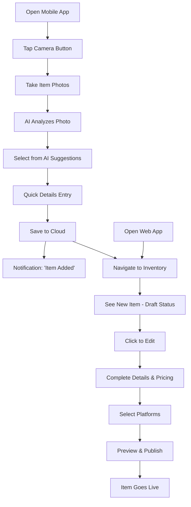
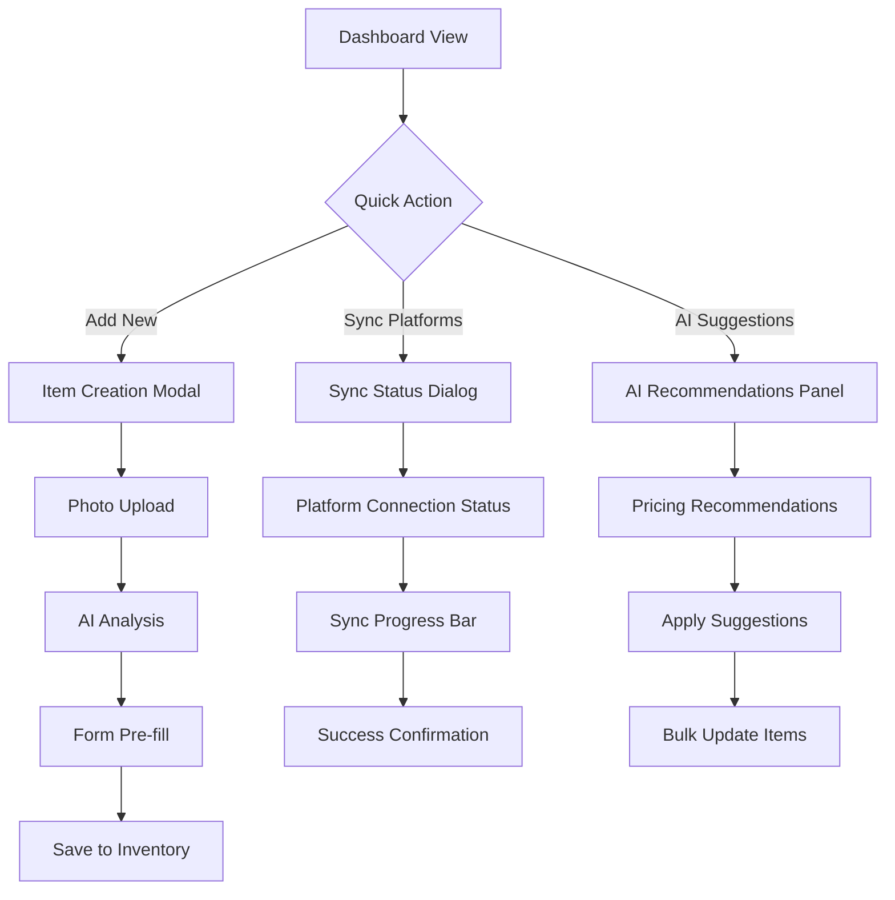
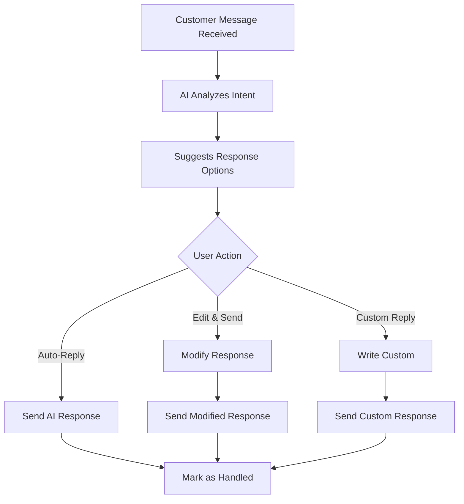

# NetPost V2 - UI Wireframes and Interaction Flows

## Overview

This document provides detailed wireframes and interaction flows for the NetPost V2 AI-Native Reselling Assistant, bridging the gap between the UI specifications and actual implementation. It leverages available ShadCN components and modern design patterns.

## Available Component Library Assets

### Core Layout Components (ShadCN Registry)
- `@shadcn/dashboard-01` - Dashboard with sidebar, charts and data table
- `@shadcn/sidebar-01` - Simple sidebar with navigation grouped by section
- `@shadcn/login-01` - Simple login form
- `@shadcn/login-04` - Login page with form and image
- `@reui/data-grid-table` - Advanced data table with sorting/filtering

### Design System Foundation
- **Color Palette**: DeepSkyBlue (#00BFFF) primary, Gold (#FFD700) accent, dark theme
- **Typography**: Inter font family
- **Grid**: 8-point grid system
- **Style**: Glassmorphism effects with minimalist line-art icons

---

## Screen-by-Screen Wireframes

### 1. Authentication Flow

#### Login/Signup Screen
```
┌─────────────────────────────────────────────────────────────┐
│                    NetPost V2 Logo                         │
│                                                             │
│  ┌─────────────────────────┐  ┌───────────────────────────┐ │
│  │                         │  │                           │ │
│  │    HERO IMAGE/VIDEO     │  │     LOGIN FORM            │ │
│  │   (Reselling Action)    │  │                           │ │
│  │                         │  │  Email: [____________]    │ │
│  │                         │  │  Password: [_________]    │ │
│  │                         │  │                           │ │
│  │                         │  │  [Sign In] [Sign Up]      │ │
│  │                         │  │                           │ │
│  │                         │  │  Or continue with:        │ │
│  │                         │  │  [Google] [Apple]         │ │
│  │                         │  │                           │ │
│  └─────────────────────────┘  └───────────────────────────┘ │
│                                                             │
│    "Streamline your reselling business with AI"            │
└─────────────────────────────────────────────────────────────┘
```

**Implementation**: Use `@shadcn/login-04` (login page with form and image)

**Interactions**:
- Email/password validation with real-time feedback
- Social auth buttons trigger OAuth flows
- Smooth transition to dashboard upon successful auth
- Form validation with inline error messages

---

### 2. Main Application Layout

#### Dashboard Layout Structure
```
┌─────────────────────────────────────────────────────────────┐
│ ☰ NetPost    [Search Bar]        🔔 [User] [Settings]     │ Header
├─────────────┬───────────────────────────────────────────────┤
│ 📊Dashboard │                                               │
│ 📦Inventory │                                               │
│ 🤖AI Assist │                                               │
│ 🔗Platform  │             MAIN CONTENT AREA                 │
│ ⚙️Settings  │                                               │
│             │                                               │
│             │                                               │
│             │                                               │
│             │                                               │
│             │                                               │
│             │                                               │
├─────────────┴───────────────────────────────────────────────┤
│ Status Bar: "Last sync: 2 min ago" | "Platform: eBay ✅"   │ Footer
└─────────────────────────────────────────────────────────────┘
```

**Implementation**: Use `@shadcn/dashboard-01` + `@shadcn/sidebar-01`

**Key Features**:
- Collapsible sidebar (hamburger toggle on mobile)
- Persistent navigation with active state indicators
- Global search bar in header
- Real-time sync status indicator

---

### 3. Dashboard Screen

#### Main Dashboard View
```
┌─────────────────────────────────────────────────────────────┐
│                    📊 Dashboard                             │
├─────────────────────────────────────────────────────────────┤
│                                                             │
│ ┌─────────────┐ ┌─────────────┐ ┌─────────────┐ ┌─────────┐ │
│ │Total Items  │ │Active Lists │ │Sold Today   │ │Revenue  │ │
│ │    247      │ │     89      │ │     12      │ │  $486   │ │
│ │  📈 +12     │ │  📊 -3      │ │  ⬆️ +8      │ │ 💰 +$89 │ │
│ └─────────────┘ └─────────────┘ └─────────────┘ └─────────┘ │
│                                                             │
│ ┌─────────────────────────────────┐ ┌───────────────────────┐ │
│ │        RECENT ACTIVITY          │ │    QUICK ACTIONS      │ │
│ │                                 │ │                       │ │
│ │ • Item sold: Vintage Watch      │ │ [➕ Add New Item]     │ │
│ │ • New listing: Nike Shoes       │ │                       │ │
│ │ • Price drop: iPhone case       │ │ [🔄 Sync Platforms]   │ │
│ │ • Customer message received     │ │                       │ │
│ │                                 │ │ [🤖 AI Suggestions]   │ │
│ │          [View All]             │ │                       │ │
│ └─────────────────────────────────┘ └───────────────────────┘ │
│                                                             │
│ ┌─────────────────────────────────────────────────────────┐ │
│ │                SALES CHART                              │ │
│ │    $                                                    │ │
│ │ 500│ ⬢─────⬢                                           │ │
│ │ 400│       ╲ ╱ ⬢                                       │ │
│ │ 300│        ⬢   ╲                                      │ │
│ │ 200│             ╲─⬢─⬢                                 │ │
│ │ 100│                  ╲                                │ │
│ │   0└────────────────────────────────                  │ │
│ │     Mon Tue Wed Thu Fri Sat Sun                       │ │
│ └─────────────────────────────────────────────────────────┘ │
└─────────────────────────────────────────────────────────────┘
```

**Implementation**: Core dashboard from `@shadcn/dashboard-01`

**Key Interactions**:
- Metric cards show trending indicators with tooltips
- Quick action buttons trigger modals/flows
- Chart is interactive with hover states
- Real-time updates with smooth animations

---

### 4. Inventory List Screen

#### Inventory Management View
```
┌─────────────────────────────────────────────────────────────┐
│ 📦 Inventory                            [➕ Add New Item]   │
├─────────────────────────────────────────────────────────────┤
│                                                             │
│ [🔍 Search items...]  [📋 All] [🟢 Active] [🔴 Sold] [⏳ Draft] │
│                                                             │
│ ┌─────────────────────────────────────────────────────────┐ │
│ │ 📷 │ Title                │ Status  │ Price │ Platform │⚙️│ │
│ ├─────┼────────────────────┼─────────┼───────┼─────────┼───┤ │
│ │[IMG]│ Vintage Rolex      │🟢 Active│ $2,500│ eBay     │⋯ │ │
│ │[IMG]│ Nike Air Jordan 1  │🟡 Draft │ $180  │ -        │⋯ │ │
│ │[IMG]│ iPhone 13 Case     │🟢 Active│ $25   │ Multiple │⋯ │ │
│ │[IMG]│ Designer Handbag   │🔴 Sold  │ $450  │ Poshmark │⋯ │ │
│ │[IMG]│ Gaming Console     │🟢 Active│ $300  │ eBay     │⋯ │ │
│ │[IMG]│ Vintage Camera     │⏳ Pending│ $150  │ Multiple │⋯ │ │
│ └─────┴────────────────────┴─────────┴───────┴─────────┴───┘ │
│                                                             │
│ [◀ Previous] Page 1 of 12                    [Next ▶]     │
│                                                             │
│ Bulk Actions: [☑️ Select All] [✏️ Edit] [🗑️ Delete] [📤 Export] │
└─────────────────────────────────────────────────────────────┘
```

**Implementation**: Use `@reui/data-grid-table` with custom styling

**Key Features**:
- Advanced filtering and search capabilities
- Sortable columns with visual indicators
- Status badges with color coding
- Bulk action toolbar appears when items selected
- Responsive grid view on mobile

**Interactions**:
- Click row to open item detail view
- Three-dot menu shows contextual actions
- Drag-and-drop for bulk operations
- Real-time status updates

---

### 5. Item Detail / Listing Editor

#### Item Creation/Editing Flow
```
┌─────────────────────────────────────────────────────────────┐
│ ✏️ Edit Item: Vintage Rolex                [Save] [Cancel] │
├─────────────────────────────────────────────────────────────┤
│                                                             │
│ ┌─────────────────┐ ┌─────────────────────────────────────┐ │
│ │                 │ │ Title: [Vintage Rolex Submariner   ] │ │
│ │     PHOTO       │ │                                     │ │
│ │   [📷 Upload]   │ │ Description:                        │ │
│ │                 │ │ ┌─────────────────────────────────┐ │ │
│ │   [🤖 AI Edit]  │ │ │ Beautiful vintage watch in     │ │ │
│ │                 │ │ │ excellent condition...          │ │ │
│ │                 │ │ │                                 │ │ │
│ │  [📋 AI Desc]   │ │ └─────────────────────────────────┘ │ │
│ └─────────────────┘ │                                     │ │
│                     │ Category: [Watches ▼]              │ │
│ ┌─────────────────┐ │ Condition: [Very Good ▼]           │ │
│ │   PLATFORMS     │ │                                     │ │
│ │ ☑️ eBay         │ │ Price: $[2500.00]                   │ │
│ │ ☐ Poshmark      │ │                                     │ │
│ │ ☐ Mercari       │ │ 🤖 AI suggests: $2,650 (market +6%)│ │
│ │ ☐ Facebook      │ │                                     │ │
│ └─────────────────┘ └─────────────────────────────────────┘ │
│                                                             │
│ ┌─────────────────────────────────────────────────────────┐ │
│ │               LISTING PREVIEW                           │ │
│ │ ┌─────────┐                                             │ │
│ │ │[IMAGE]  │ Vintage Rolex Submariner                    │ │
│ │ │         │ $2,500                                      │ │
│ │ │         │ ⭐⭐⭐⭐⭐ Excellent condition                    │ │
│ │ └─────────┘                                             │ │
│ └─────────────────────────────────────────────────────────┘ │
└─────────────────────────────────────────────────────────────┘
```

**Key Features**:
- Side-by-side photo and form layout
- AI-powered description generation
- Real-time pricing suggestions
- Multi-platform selection with platform-specific previews
- Live preview updates as form changes

**AI Integration Points**:
- Photo background removal/enhancement
- Auto-generated descriptions based on photos
- Market-based pricing recommendations
- Category auto-detection

---

### 6. Mobile App Wireframes

#### Mobile Sourcing Flow
```
┌─────────────────────┐
│  📱 NetPost Mobile  │
├─────────────────────┤
│                     │
│ ┌─────────────────┐ │
│ │                 │ │
│ │   CAMERA VIEW   │ │
│ │                 │ │
│ │      [📷]       │ │
│ │                 │ │
│ │  [🔦] [⚙️] [?]  │ │
│ └─────────────────┘ │
│                     │
│ [📦 Scan Barcode]   │
│                     │
│ [🤖 AI Identify]    │
│                     │
│ [✏️ Manual Entry]   │
│                     │
├─────────────────────┤
│ Recent Items (3)    │
├─────────────────────┤
│ [⚙️] [👤] [🔄]      │
└─────────────────────┘
```

#### After Photo Capture
```
┌─────────────────────┐
│  📷 Item Captured   │
├─────────────────────┤
│                     │
│ ┌─────────────────┐ │
│ │ [ITEM PHOTO]    │ │
│ │                 │ │
│ └─────────────────┘ │
│                     │
│ 🤖 AI Suggestions:  │
│                     │
│ ┌─────────────────┐ │
│ │ ✓ Vintage Watch │ │
│ │   Est: $2,500   │ │
│ └─────────────────┘ │
│                     │
│ ┌─────────────────┐ │
│ │ ○ Jewelry       │ │
│ │   Est: $800     │ │
│ └─────────────────┘ │
│                     │
│ [✓ Select] [↺ Retake] │
│                     │
└─────────────────────┘
```

---

## Key Interaction Flows

### Flow 1: New Item Sourcing (Mobile → Web)



### Flow 2: Dashboard Quick Actions



### Flow 3: AI-Assisted Communication



---

## Design System Bridge

### Component Mapping
| UI Spec Component | ShadCN Component | Customizations Needed |
|-------------------|------------------|----------------------|
| Main Layout | `@shadcn/dashboard-01` | Color scheme, glassmorphism |
| Sidebar Navigation | `@shadcn/sidebar-01` | Icons, sections grouping |
| Data Tables | `@reui/data-grid-table` | Status badges, bulk actions |
| Login Forms | `@shadcn/login-04` | Branding, social auth |
| Item Cards | Custom + `@shadcn/card` | Image handling, status indicators |

### Animation Requirements
- **Page Transitions**: 300ms ease-out
- **Modal Appearances**: 200ms scale + fade
- **Loading States**: Skeleton screens + pulse
- **Micro-interactions**: Hover states 150ms
- **Status Changes**: Color transitions 400ms

---

## Next Steps

1. **Component Selection & Setup**
   - Install selected ShadCN components
   - Create custom theme configuration
   - Set up animation system

2. **Layout Implementation**
   - Build responsive grid system
   - Implement sidebar navigation
   - Create page templates

3. **Feature Integration**
   - Connect AI services to UI components
   - Implement real-time data binding
   - Add progressive enhancement

4. **Visual Polish**
   - Apply glassmorphism effects
   - Add micro-interactions
   - Implement dark mode