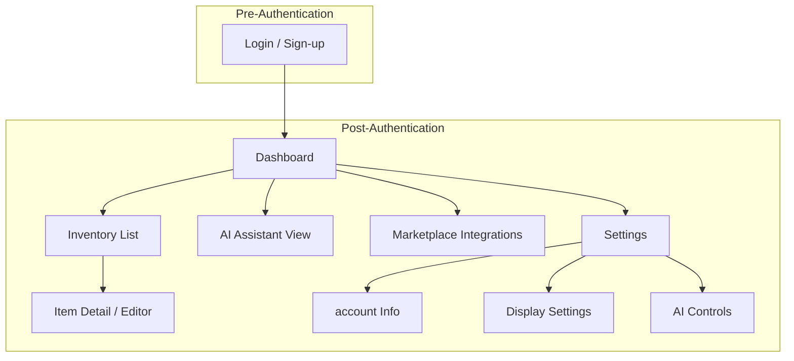

# Information Architecture (IA)

## Site Map / Screen Inventory

This site map illustrates the primary screens of the application and their relationship to one another. It is based on the core screens identified in the PRD.

## Navigation Structure

**Primary Navigation**: After logging in, the main navigation (e.g., a persistent sidebar) will provide direct access to the application's core sections: Dashboard, Inventory, AI Assistant, Marketplace Integrations, and Settings.

**Secondary Navigation**: Within complex sections like "Settings," a secondary navigation (e.g., tabs) will be used to switch between subsections like "Account," "Display," and "AI Controls."

**Breadcrumb Strategy**: Breadcrumbs will be used on deeply nested pages (like the Item Detail / Editor) to provide clear context and easy one-click navigation back to parent pages (e.g., Home > Inventory > Item Name).
